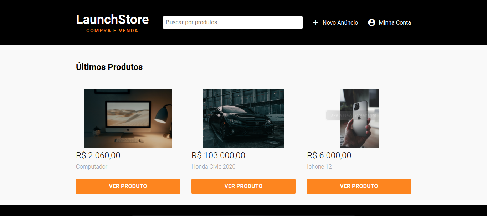

<h1 align="center">:rocket: LaunchStore :rocket:</h1>

   
  

  <strong>🛒 O E-commerce perfeito para você 🛒</strong> 
  <a href="https://launchstore-project.herokuapp.com">Acessar LaunchStore</a>

 

## :notebook: Sobre o Projeto
LaunchStore é um E-commerce desenvolvido durante o final do bootcamp LaunchBase da Rocketseat, onde você pode criar uma conta e anunciar seus produtos.

## 🕵🏻 Funcionalidades
  * 👱🏻 Sistema de autenticação
  * 🔒 Sistema de recuperação de senha por email
  * 💰 Sistema de cadastro de produtos
  * 📸 Sistema de upload de imagens
  * 🕺 Animações ao comprar um produto

## :gear: Tecnologias Utilizadas

* HTML
* CSS
* JavaScript
* Node.js
* PostgreSQL
* Nunjucks

## 🌎 Acesso em : 

  <a href="https://launchstore-project.herokuapp.com">Acessar LaunchStore</a>

 

  Desenvolvido por <strong>Felipe Valério</strong>

